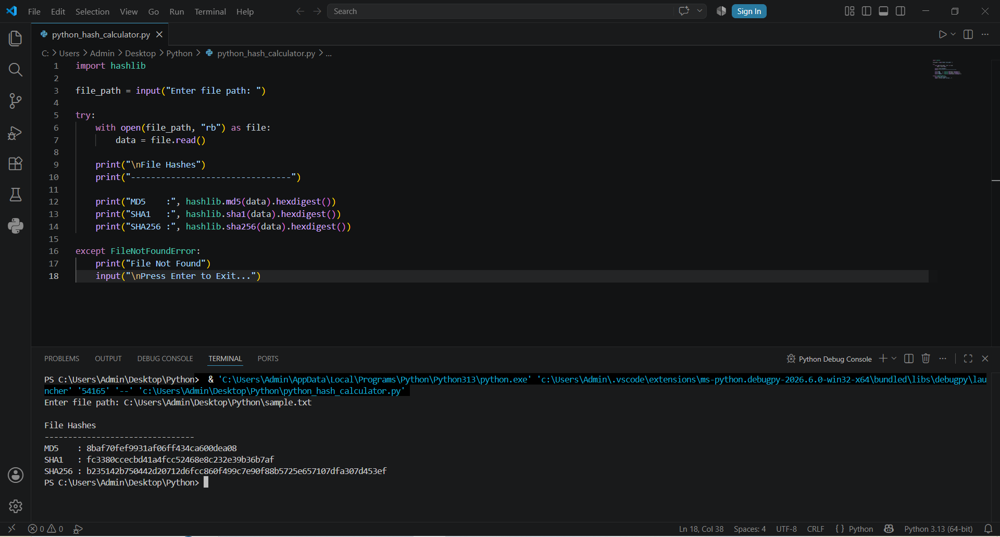

# Python Hash Calculator

A simple Digital Forensics tool developed in Python to calculate **MD5**, **SHA1**, and **SHA256** hash values of a file.

## Features

- Calculate MD5 hash
- Calculate SHA1 hash
- Calculate SHA256 hash
- Easy command-line interface
- Basic error handling for invalid file paths

## Forensic Significance

Hash values are used in Digital Forensics to verify the integrity of digital evidence. If the hash value remains unchanged, it confirms that the file has not been modified during acquisition, transfer, or analysis.

## Requirements

- Python 3.x

## How to Run

```bash
python python_hash_calculator.py
```

Enter the complete file path when prompted.

## Example Output



## Author

**Yogesh Niranjan**


